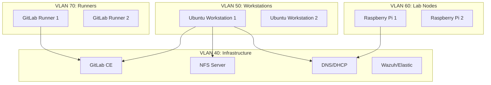

# Field Lab Ansible Portfolio


**A production-grade Infrastructure as Code (IaC) portfolio project demonstrating advanced Linux Systems Administration, Security Hardening, and DevOps automation.**

---

## 🚀 Project Overview

This repository contains a complete Ansible-driven lab environment designed to mirror a real-world R&D SysAdmin setup. It automates the provisioning of developer workstations, CI/CD runners, and core infrastructure services, emphasizing security best practices (CIS-lite) and disaster recovery.

**GitHub Repository:** [https://github.com/daryllundy/field-lab-ansible-portfolio](https://github.com/daryllundy/field-lab-ansible-portfolio)

**Key Features:**
- **Automated Hardening**: CIS-lite baseline, SSH hardening, UFW firewall, and Fail2Ban.
- **Developer Platform**: Automated deployment of VS Code Server and JupyterLab for R&D workflows.
- **CI/CD Infrastructure**: Self-hosted GitLab CE and Docker-based GitLab Runners.
- **Resilient Storage**: NFS-backed storage with automated Restic backups and DR restore playbooks.
- **Observability**: EDR-style telemetry using Elastic Agent.

## 🛠️ Skills Demonstrated

| Category | Technologies & Skills |
|----------|----------------------|
| **Automation & IaC** | Ansible (Roles, Playbooks, Molecule Testing), Makefiles, Bash Scripting |
| **Linux Administration** | Ubuntu/Debian, Systemd, User Management, Package Management (Apt) |
| **Security** | CIS Hardening, SSH Key Management, Firewall (UFW), Fail2Ban, Unattended Upgrades |
| **Networking** | VLANs, DNS/DHCP (Dnsmasq), Unbound, Netplan |
| **DevOps & CI/CD** | GitLab CI, GitLab Runners, Docker, GitHub Actions |
| **Storage & DR** | NFS, Restic Backups, Disaster Recovery Planning & Testing |

## 🏗️ Architecture



## ⚡ Quickstart

### Prerequisites
- Python 3.11+
- Docker (for Molecule tests)

### 1. Setup Environment
Initialize the project and install dependencies:
```bash
make setup
source .venv/bin/activate
```

### 2. Configure Inventory
Edit `inventories/lab.ini` to match your target hosts. Update secrets in `group_vars/`.

### 3. Deploy
Bootstrap and harden the environment:
```bash
make bootstrap
make harden
```

Deploy developer tools and infrastructure:
```bash
make dev-tools
make network
make storage
```

### 4. Verify
Run the test suite (requires Docker):
```bash
make test
```

## 📂 Project Structure

```
├── ansible/
│   ├── playbooks/      # Main orchestration playbooks
│   ├── roles/          # Reusable Ansible roles (hardening, gitlab, etc.)
│   └── files/          # Static assets
├── inventories/        # Host definitions
├── group_vars/         # Configuration variables
├── docs/               # Operational runbooks
├── diagrams/           # Architecture diagrams
└── Makefile            # Automation shortcuts
```

## 📄 License

MIT License © 2025 Daryl Lundy

## 🧪 Testing

This project includes comprehensive testing to ensure infrastructure correctness and reliability.

### Test Suite Overview

The testing strategy combines multiple approaches:

| Test Type | Framework | Purpose | Count |
|-----------|-----------|---------|-------|
| **Property-Based Tests** | Hypothesis | Validate correctness across random inputs | 15 tests |
| **Configuration Tests** | pytest | Verify configuration structure | 16 tests |
| **Integration Tests** | Molecule + Testinfra | End-to-end role validation | 10 roles |
| **Linting** | ansible-lint, yamllint | Code quality and best practices | - |

### Running Tests

#### Quick Test Commands

```bash
# Run all tests (excluding Molecule)
make test

# Run linting only
make lint

# Run property-based tests
uv run pytest tests/test_property_*.py -v

# Run configuration validation tests
uv run pytest tests/ -v -k "not molecule"

# Run Molecule tests for a specific role
cd ansible/roles/base_hardening
molecule test
```

#### Detailed Test Execution

**1. Property-Based Tests (Hypothesis)**

These tests validate correctness properties across 100 randomly generated inputs each:

```bash
# All property tests
uv run pytest tests/test_property_*.py -v

# Specific property test categories
uv run pytest tests/test_property_idempotency.py -v
uv run pytest tests/test_property_variable_substitution.py -v
uv run pytest tests/test_property_inventory_parsing.py -v
```

**2. Configuration Validation Tests**

```bash
# Inventory and variable structure
uv run pytest tests/test_inventory_config.py -v

# CI/CD configuration
uv run pytest tests/test_cicd.py -v

# Makefile targets
uv run pytest tests/test_makefile.py -v

# Molecule configuration
uv run pytest tests/test_molecule_config.py -v
```

**3. Molecule Integration Tests**

Molecule tests run roles in Docker containers and verify the results:

```bash
# Test all roles with Molecule
make test

# Test individual role
cd ansible/roles/<role_name>
molecule test

# Available roles with Molecule tests:
# - base_hardening
# - users
# - packages
# - gitlab
# - gitlab_runner
# - vscode_server
# - jupyter
# - network
# - storage
# - monitoring
# - dr_test
```

### Property-Based Testing Details

Property-based tests use Hypothesis to generate random test cases and validate universal properties:

#### Role Idempotency Tests (3 properties)
- **Property 1**: Base hardening configuration consistency
- **Property 2**: Users role configuration consistency  
- **Property 3**: Configuration state consistency

```python
# Example: Validates that configuration survives serialization
@given(config=base_hardening_config())
def test_base_hardening_idempotency(config):
    yaml_str = yaml.dump(config)
    reloaded = yaml.safe_load(yaml_str)
    assert reloaded == config
```

#### Variable Substitution Tests (6 properties)
- **Property 4**: Global variables round-trip validation
- **Property 5**: Workstation variables round-trip validation
- **Property 6**: Runner variables round-trip validation
- **Property 7**: Infrastructure variables round-trip validation
- **Property 8**: URL substitution consistency
- **Property 9**: Path substitution consistency

#### Inventory Parsing Tests (6 properties)
- **Property 10**: Inventory parsing consistency
- **Property 11**: Group membership validation
- **Property 12**: Host resolution validation
- **Property 13**: Inventory round-trip idempotency
- **Property 14**: Group hierarchy validation
- **Property 15**: Host update consistency

### Test Coverage

```bash
# View test coverage summary
uv run pytest tests/ --cov=. --cov-report=term-missing

# Generate HTML coverage report
uv run pytest tests/ --cov=. --cov-report=html
```

### Continuous Integration

GitHub Actions automatically runs on every push and pull request:

```yaml
# .github/workflows/ci.yml
- Linting (ansible-lint, yamllint)
- Python 3.11 environment
- Automated validation of all Ansible code
```

View CI status: 

### Test Development

#### Adding New Property Tests

1. Create test file in `tests/test_property_*.py`
2. Use Hypothesis strategies to generate test data
3. Tag with `@pytest.mark.property`
4. Run 100+ iterations per test

```python
from hypothesis import given, strategies as st, settings

@pytest.mark.property
@given(value=st.text())
@settings(max_examples=100)
def test_my_property(value):
    # Test implementation
    assert some_property_holds(value)
```

#### Adding New Molecule Tests

1. Create `molecule/default/` directory in role
2. Add `molecule.yml` configuration
3. Create `converge.yml` playbook
4. Add testinfra tests in `tests/test_default.py`

```bash
cd ansible/roles/my_role
molecule init scenario
molecule test
```

### Troubleshooting Tests

**Docker Issues (Molecule)**
```bash
# Ensure Docker is running
docker ps

# Clean up old containers
molecule destroy
```

**Hypothesis Failures**
```bash
# View detailed failure information
uv run pytest tests/test_property_*.py -v --tb=long

# Reproduce specific failure
# Hypothesis saves failing examples in .hypothesis/
```

**Import Errors**
```bash
# Reinstall dependencies
uv sync

# Verify installation
uv run pytest --version
```

### Test Metrics

- **Total Tests**: 31+ (excluding Molecule)
- **Property Tests**: 15 tests × 100 iterations = 1,500 test cases
- **Configuration Tests**: 16 tests
- **Molecule Integration Tests**: 10 roles
- **Average Test Runtime**: ~2 seconds (property tests), ~5 minutes (Molecule per role)

