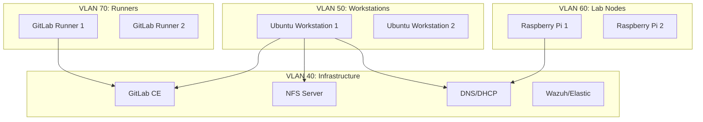

# Field Lab Ansible Portfolio


**A production-grade Infrastructure as Code (IaC) portfolio project demonstrating advanced Linux Systems Administration, Security Hardening, and DevOps automation.**

---

## 🚀 Project Overview

This repository contains a complete Ansible-driven lab environment designed to mirror a real-world R&D SysAdmin setup. It automates the provisioning of developer workstations, CI/CD runners, and core infrastructure services, emphasizing security best practices (CIS-lite) and disaster recovery.

**Key Features:**
- **Automated Hardening**: CIS-lite baseline, SSH hardening, UFW firewall, and Fail2Ban.
- **Developer Platform**: Automated deployment of VS Code Server and JupyterLab for R&D workflows.
- **CI/CD Infrastructure**: Self-hosted GitLab CE and Docker-based GitLab Runners.
- **Resilient Storage**: NFS-backed storage with automated Restic backups and DR restore playbooks.
- **Observability**: EDR-style telemetry using Elastic Agent.

## 🛠️ Skills Demonstrated

| Category | Technologies & Skills |
|----------|----------------------|
| **Automation & IaC** | Ansible (Roles, Playbooks, Molecule Testing), Makefiles, Bash Scripting |
| **Linux Administration** | Ubuntu/Debian, Systemd, User Management, Package Management (Apt) |
| **Security** | CIS Hardening, SSH Key Management, Firewall (UFW), Fail2Ban, Unattended Upgrades |
| **Networking** | VLANs, DNS/DHCP (Dnsmasq), Unbound, Netplan |
| **DevOps & CI/CD** | GitLab CI, GitLab Runners, Docker, GitHub Actions |
| **Storage & DR** | NFS, Restic Backups, Disaster Recovery Planning & Testing |

## 🏗️ Architecture



## ⚡ Quickstart

### Prerequisites
- Python 3.11+
- Docker (for Molecule tests)

### 1. Setup Environment
Initialize the project and install dependencies:
```bash
make setup
source .venv/bin/activate
```

### 2. Configure Inventory
Edit `inventories/lab.ini` to match your target hosts. Update secrets in `group_vars/`.

### 3. Deploy
Bootstrap and harden the environment:
```bash
make bootstrap
make harden
```

Deploy developer tools and infrastructure:
```bash
make dev-tools
make network
make storage
```

### 4. Verify
Run the test suite (requires Docker):
```bash
make test
```

## 📂 Project Structure

```
├── ansible/
│   ├── playbooks/      # Main orchestration playbooks
│   ├── roles/          # Reusable Ansible roles (hardening, gitlab, etc.)
│   └── files/          # Static assets
├── inventories/        # Host definitions
├── group_vars/         # Configuration variables
├── docs/               # Operational runbooks
├── diagrams/           # Architecture diagrams
└── Makefile            # Automation shortcuts
```

## 📄 License

MIT License © 2025 Daryl Lundy
