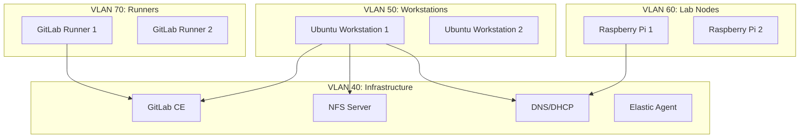

# Field Lab Ansible Portfolio


Ansible-driven lab environment mirroring an R&D SysAdmin setup. Automates provisioning of developer workstations, CI/CD runners, and core infrastructure services across a segmented Ubuntu network — with a security-first baseline (CIS-lite), NFS-backed storage, and disaster recovery playbooks.

---

## Architecture


```mermaid
graph TD
    subgraph "VLAN 40: Infrastructure"
        GitLab[GitLab CE]
        NFS[NFS Server]
        DNS[DNS/DHCP]
        Elastic[Elastic Agent]
    end

    subgraph "VLAN 50: Workstations"
        WS1[Ubuntu Workstation 1]
        WS2[Ubuntu Workstation 2]
    end

    subgraph "VLAN 60: Lab Nodes"
        Pi1[Raspberry Pi 1]
        Pi2[Raspberry Pi 2]
    end

    subgraph "VLAN 70: Runners"
        Runner1[GitLab Runner 1]
        Runner2[GitLab Runner 2]
    end

    WS1 --> GitLab
    WS1 --> NFS
    Runner1 --> GitLab
    Pi1 --> DNS
    WS1 --> DNS
```

## Quickstart

**Prerequisites:** Python 3.11+, Docker (for Molecule tests)

```bash
# Install dependencies
make setup
source .venv/bin/activate

# Edit inventories/lab.ini to match your hosts
# Update secrets in group_vars/

# Bootstrap and harden
make bootstrap
make harden

# Deploy dev tools and infra services
make dev-tools
make network
make storage
```

## Project Structure

```
├── ansible/
│   ├── playbooks/      # Orchestration playbooks
│   └── roles/          # Roles: base_hardening, users, gitlab, gitlab_runner,
│                       #        vscode_server, jupyter, network, storage,
│                       #        monitoring, dr_test, packages
├── inventories/        # Host definitions
├── group_vars/         # Variable hierarchy
├── docs/               # Operational runbooks
└── Makefile            # Make targets for all operations
```

## Testing

```bash
# Lint (ansible-lint + yamllint)
make lint

# pytest: config validation + Hypothesis property tests
uv run pytest

# Molecule integration tests (requires Docker)
make test
```

The `tests/` directory has two layers:
- **Config tests** — verify inventory structure, group_vars completeness, Makefile targets, CI config
- **Property tests** — use [Hypothesis](https://hypothesis.readthedocs.io/) to validate YAML round-trip correctness and inventory parsing across generated inputs

## License

MIT License © 2025 Daryl Lundy
